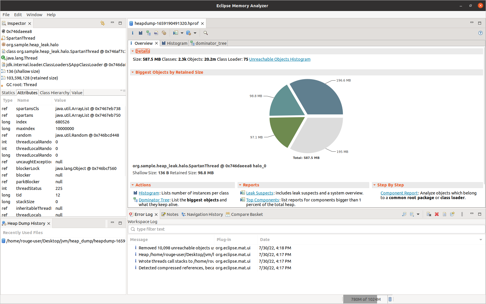
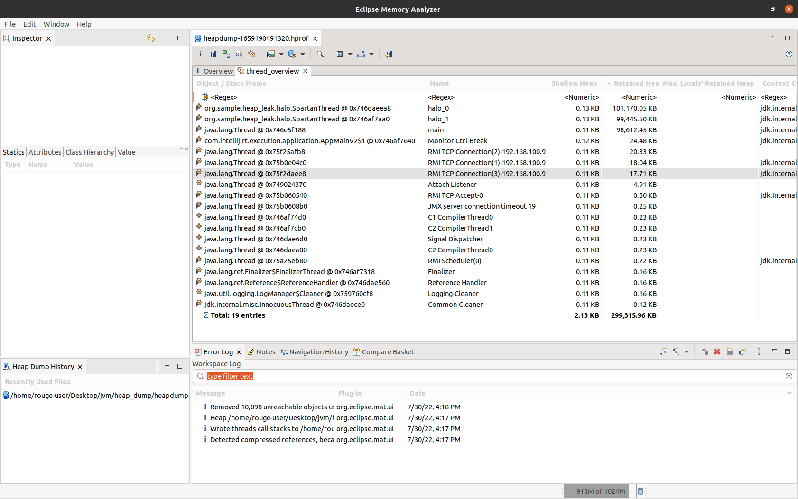
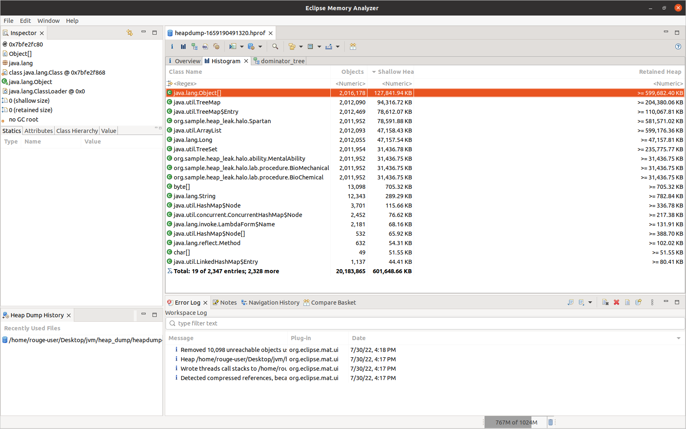
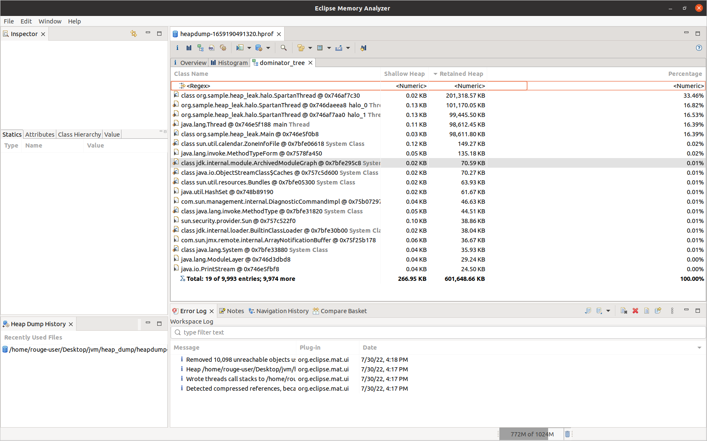

# heap-leak

## Introduction

The project's purpose is to create conditions for heap leak on threads like : application [] and
other
non-daemon.

### Heap dump analysis (Eclipse Memory Analyzer) :

**Overview :**

**Stack :**

**Class histogram :**

**Dominator tree :**
